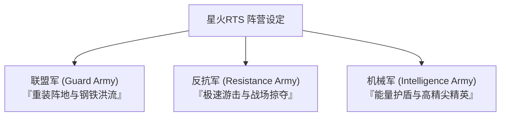

# ⚔️ 星火RTS 阵营非对称设计方案（联盟 vs 反抗 vs 机械）

为了让三方阵营在战斗中有截然不同的战略体验和美术视觉，设计了以下非对称阵营玩法及对应的模型风格指南：

---

---

## 🪖 1. 联盟军 (Guard Army) —— 钢铁防线与重炮轰炸
> **核心优势**：重型装甲、防御阵地、大范围超远打击。

### 🎮 玩法与机制设计
* **阵地堡垒**：步兵和坦克在防御炮塔或主基地范围内，防御力提升 `15%`（适合稳扎稳打防守反击）。
* **充足电力**：发电厂提供双倍的电力负载能力，极少受断电干扰。
* **钢铁洪流**：随着战役进行可以堆起最高防御属性的坦克集团。

### 🚀 特色代表兵种
* **自行火炮 (`artillery`)**：射程是普通单位的 2 倍，可远距离瘫痪敌方群聚单位。
* **重型坦克 (`heavy_tank`)**：拥有极高的血量上限，是正面的绝对屏障。

### 🎨 3D 模型风格建议
* **风格特征**：正统、威严、硬朗的现代化/二战正规军钢铁风格。
* **模型特征**：迷彩涂装（草绿、泥黄、数码迷彩）、车身装甲厚实，带有铆钉、反应装甲板块、沙袋等防守装饰。

---

## 🦅 2. 反抗军 (Resistance Army) —— 闪电奔袭与黑市掠夺
> **核心优势**：高机动性、快速开图、以战养战。

### 🎮 玩法与机制设计
* **黑市交易**：击杀敌方单位时有几率直接掠夺并获得 `20%` 敌方造价的金币，以战养战。
* **林地伪装**：在草丛或树林里移动速度增加 `25%`，且在开雾前有伪装效果。
* **人海暴兵**：兵营和特工工厂的生产时间缩短 `20%`，能迅速拉起炮灰部队。

### 🚀 特色代表兵种
* **喷火兵 (`infantry_flamethrower`)**：近身伤害极高，且喷射的火焰可造成无视护甲的持续燃烧效果。
* **轻型坦克 (`light_tank`)**：移动速度极快，是突袭敌方金矿和雷达后方防线的利器。
* **侦察机 (`scout_plane`)**：提供全游戏最广的视野范围，负责精准开图。

### 🎨 3D 模型风格建议
* **风格特征**：废土、粗犷、拼接、轻便且富有个性的义军/游击队风格。
* **模型特征**：有铁锈、磨损、喷漆涂鸦；坦克多为轮式装甲车或改装车；步兵穿着便服、披风或绑带。

---

## 🤖 3. 机械军 (Intelligence Army) —— 能量护盾与科技碾压
> **核心优势**：自动回盾、单体爆发伤害、高能轰炸。

### 🎮 玩法与机制设计
* **等离子护盾 (Shield)**：所有车辆和机械单位自带一层能量护盾（血条上方的蓝条），在脱离战斗 5 秒后以极快的速度自动恢复。
* **超载生产**：可以通过手动超载发电厂，短时间内让全基地生产速提升 `50%`，但消耗大量电力。
* **高人口限制**：单位战力强 but 占用人口高，无法使用廉价的暴兵流。

### 🚀 特色代表兵种
* **防空炮车 (`anti_air_gun`)**：发射科技感十足的追踪电磁弹，对战机和空军有百分之百的压制。
* **轰炸机 (`bomber`)**：装载科技能量炸弹，可一波摧毁密集的地面防线。

### 🎨 3D 模型风格建议
* **风格特征**：科幻、高精尖、带有发光条 of 机械/智能风。
* **模型特征**：流线型车身、灰白色或钛合金哑光涂装；带有淡蓝色/淡紫色科技感发光能量线条，甚至可以使用悬浮车身（无轮子）的造型。

---

## 📈 阵营克制闭环

$$联盟军 (重装防御) \xrightarrow{火力碾压} 机械军 (高科技护盾) \xrightarrow{风筝牵制} 反抗军 (速度与奇袭) \xrightarrow{人海渗入/偷矿} 联盟军 (重装防御)$$

这份设计直接影响您的模型筛选：
* 联盟军 -> 选**绿/沙色、带履带和钢铁铆钉的写实二战坦克**；
* 反抗军 -> 选**改装车、皮卡、轻便越野风格的粗犷载具**；
* 机械军 -> 选**悬浮车身、白色哑光涂装、带发光灯带的科幻/机甲风格载具**。
